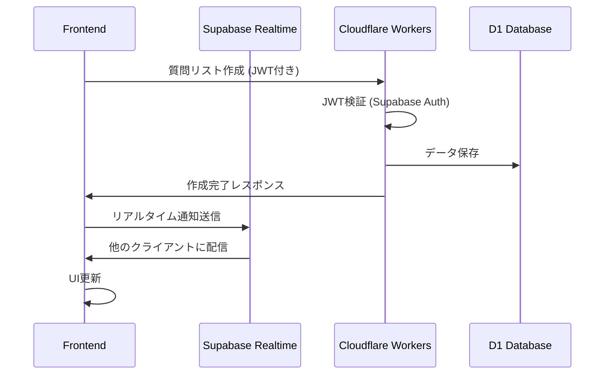

# 設計書

## 概要

保育園・幼稚園見学質問リスト管理アプリは、PWA（Progressive Web App）として実装し、ローカルファースト設計を採用します。スマートフォンでの使いやすさを最優先とし、オフライン機能とリアルタイム同期を提供する現代的な Web アプリケーションです。

## アーキテクチャ

### 全体アーキテクチャ

```
┌─────────────────────────────────────┐
│           PWA Frontend              │
│  ┌─────────────┐ ┌─────────────────┐│
│  │   React     │ │  Service Worker ││
│  │ Components  │ │  (Offline Cache)││
│  └─────────────┘ └─────────────────┘│
└─────────────────────────────────────┘
           │                 │
           ▼                 ▼
┌─────────────────┐ ┌─────────────────┐
│   IndexedDB     │ │  Supabase Auth  │
│ (Offline Cache) │ │   & Realtime    │
└─────────────────┘ └─────────────────┘
           │                 │
           ▼                 ▼
┌─────────────────┐ ┌─────────────────┐
│ Cloudflare      │ │   Cloudflare    │
│ Workers (API)   │ │   D1 (SQLite)   │
└─────────────────┘ └─────────────────┘
```

### 技術スタック

- **フロントエンド**: React 19 + TypeScript + Vite
- **UI フレームワーク**: Chakra UI v3 + Emotion
- **状態管理**: Zustand（軽量でシンプル）
- **バックエンド API**: Cloudflare Workers（エッジ実行）
- **データベース**: Cloudflare D1（SQLite、分散型）
- **認証**: Supabase Auth（OAuth対応）
- **リアルタイム通信**: Supabase Realtime（WebSocket）
- **オフラインキャッシュ**: IndexedDB（Dexie.js ラッパー使用）
- **PWA**: Workbox（Service Worker 管理）
- **テスト**: Vitest + React Testing Library
- **ホスティング**: Cloudflare Workers Static Assets

#### ハイブリッド構成の選択理由

**Supabase（認証・リアルタイム）**:

- **OAuth認証**: Google/LINE簡単設定
- **リアルタイム機能**: WebSocket ベースの自動同期
- **実績**: 安定した認証・リアルタイム機能

**Cloudflare（API・データベース・ホスティング）**:

- **エッジ実行**: 世界中で低レイテンシ
- **D1データベース**: SQLiteベース、高速クエリ
- **統合プラットフォーム**: Workers + D1 + Static Assets
- **コスト効率**: 使用量ベース課金
- **最新技術**: 将来性の高いプラットフォーム

## コンポーネント設計

### 主要コンポーネント

#### 1. アプリケーション層

- **App**: ルートコンポーネント、PWA 初期化
- **Router**: ページルーティング管理
- **Layout**: 共通レイアウト、ナビゲーション

#### 2. ページコンポーネント

- **HomePage**: 保育園カード一覧、新規保育園追加ボタン
- **NurseryDetailPage**: 保育園詳細、見学日設定、質問リスト管理、回答入力
- **TemplatePage**: 質問テンプレート選択・管理
- **SettingsPage**: アプリ設定、データ管理
- **PrintPage**: 印刷用レイアウト

#### 3. 機能コンポーネント

- **NurseryCard**: 保育園カード表示
- **NurseryForm**: 保育園情報入力・編集フォーム
- **VisitSessionCard**: 見学セッションカード表示
- **VisitSessionForm**: 見学セッション作成・編集フォーム
- **QuestionItem**: 個別質問表示・編集
- **AnswerInput**: 回答入力フォーム
- **NotesSection**: 見学メモ入力（文字数制限・自動保存機能付き）
- **TemplateSelector**: 質問テンプレート選択
- **SyncIndicator**: 同期状況表示
- **OfflineIndicator**: オフライン状態表示
- **ShareModal**: 共有設定モーダル

### データモデル

#### Nursery（保育園）

```typescript
interface Nursery {
  id: string;
  name: string;
  visitSessions: VisitSession[];
  notes?: string;
  createdAt: Date;
  updatedAt: Date;
}
```

#### VisitSession（見学セッション）

```typescript
interface VisitSession {
  id: string;
  visitDate: Date;
  status: 'planned' | 'completed' | 'cancelled';
  questions: Question[];
  notes?: string; // 見学メモ（2000文字制限・自動保存・リアルタイム警告機能付き）
  sharedWith?: string[]; // 共有相手のID
  createdAt: Date;
  updatedAt: Date;
}
```

#### Question（質問）

```typescript
interface Question {
  id: string;
  text: string;
  answer?: string;
  isAnswered: boolean;
  answeredBy?: string; // 回答者ID
  answeredAt?: Date;
  createdAt: Date;
  updatedAt: Date;
}
```

#### QuestionTemplate（質問テンプレート）

```typescript
interface QuestionTemplate {
  id: string;
  title: string;
  description?: string;
  ageGroup?: string; // '0-1歳', '1-2歳', '2-3歳', '一般'
  questions: Omit<
    Question,
    'id' | 'answer' | 'isAnswered' | 'answeredBy' | 'answeredAt'
  >[];
  createdAt: Date;
  updatedAt: Date;
}
```

#### SyncState（同期状態）

```typescript
interface SyncState {
  isOnline: boolean;
  lastSyncAt?: Date;
  pendingChanges: number;
  conflictResolution?: 'local' | 'remote' | 'manual';
}
```

## インターフェース設計

### API 設計（内部）

#### データストア（IndexedDB）

```typescript
class DataStore {
  // 質問リスト管理
  async createQuestionList(list: QuestionList): Promise<string>;
  async getQuestionList(id: string): Promise<QuestionList | null>;
  async updateQuestionList(
    id: string,
    updates: Partial<QuestionList>
  ): Promise<void>;
  async deleteQuestionList(id: string): Promise<void>;
  async getAllQuestionLists(): Promise<QuestionList[]>;

  // 質問管理
  async updateQuestion(
    listId: string,
    questionId: string,
    updates: Partial<Question>
  ): Promise<void>;
  async addQuestion(
    listId: string,
    question: Omit<Question, 'id'>
  ): Promise<string>;
  async deleteQuestion(listId: string, questionId: string): Promise<void>;

  // テンプレート管理
  async getTemplates(): Promise<QuestionList[]>;
  async createFromTemplate(
    templateId: string,
    customizations: Partial<QuestionList>
  ): Promise<string>;
}
```

#### Supabase サービス（認証・リアルタイム）

```typescript
class SupabaseAuthService {
  // OAuth認証管理
  async signInWithGoogle(): Promise<User>;
  async signInWithLine(): Promise<User>;
  async signOut(): Promise<void>;
  async getCurrentUser(): Promise<User | null>;
  async getSession(): Promise<Session | null>;
}

class SupabaseRealtimeService {
  // リアルタイム同期
  subscribeToQuestionList(
    listId: string,
    callback: (payload: any) => void
  ): RealtimeSubscription;

  broadcastQuestionUpdate(listId: string, questionData: any): Promise<void>;

  subscribeToUserPresence(
    listId: string,
    callback: (users: any[]) => void
  ): RealtimeSubscription;
}
```

#### Cloudflare Workers API

```typescript
class CloudflareAPIService {
  // 質問リスト管理（D1データベース）
  async createQuestionList(
    list: Omit<QuestionList, 'id' | 'createdAt' | 'updatedAt'>,
    authToken: string
  ): Promise<QuestionList>;

  async getQuestionLists(authToken: string): Promise<QuestionList[]>;

  async updateQuestionList(
    id: string,
    updates: Partial<QuestionList>,
    authToken: string
  ): Promise<QuestionList>;

  async deleteQuestionList(id: string, authToken: string): Promise<void>;

  // 共有機能
  async shareQuestionList(
    listId: string,
    email: string,
    authToken: string
  ): Promise<void>;

  async getSharedLists(authToken: string): Promise<QuestionList[]>;

  async removeShare(
    listId: string,
    userId: string,
    authToken: string
  ): Promise<void>;

  // 同期状態管理
  getSyncState(): SyncState;
  onSyncStateChange(callback: (state: SyncState) => void): void;
}
```

#### データベーススキーマ（Cloudflare D1 - SQLite）

```sql
-- ユーザープロファイル
CREATE TABLE profiles (
  id TEXT PRIMARY KEY, -- Supabase User ID
  email TEXT UNIQUE,
  display_name TEXT,
  provider TEXT NOT NULL, -- 'google', 'line' など
  provider_id TEXT NOT NULL, -- プロバイダー固有のユーザーID
  avatar_url TEXT, -- プロフィール画像URL
  created_at DATETIME DEFAULT CURRENT_TIMESTAMP,
  updated_at DATETIME DEFAULT CURRENT_TIMESTAMP,
  UNIQUE(provider, provider_id)
);

-- 質問リスト
CREATE TABLE question_lists (
  id TEXT PRIMARY KEY, -- UUID v4
  title TEXT NOT NULL,
  nursery_name TEXT,
  visit_date DATE,
  owner_id TEXT REFERENCES profiles(id) NOT NULL,
  is_template INTEGER DEFAULT 0, -- SQLite boolean
  created_at DATETIME DEFAULT CURRENT_TIMESTAMP,
  updated_at DATETIME DEFAULT CURRENT_TIMESTAMP
);

-- 質問
CREATE TABLE questions (
  id TEXT PRIMARY KEY, -- UUID v4
  list_id TEXT REFERENCES question_lists(id) ON DELETE CASCADE,
  text TEXT NOT NULL,
  answer TEXT,
  is_answered INTEGER DEFAULT 0, -- SQLite boolean
  answered_by TEXT REFERENCES profiles(id),
  answered_at DATETIME,
  created_at DATETIME DEFAULT CURRENT_TIMESTAMP,
  updated_at DATETIME DEFAULT CURRENT_TIMESTAMP
);

-- 共有設定
CREATE TABLE question_list_shares (
  id TEXT PRIMARY KEY, -- UUID v4
  list_id TEXT REFERENCES question_lists(id) ON DELETE CASCADE,
  shared_with TEXT REFERENCES profiles(id) ON DELETE CASCADE,
  permission TEXT CHECK (permission IN ('read', 'write')) DEFAULT 'write',
  created_at DATETIME DEFAULT CURRENT_TIMESTAMP,
  UNIQUE(list_id, shared_with)
);

-- インデックス（パフォーマンス最適化）
CREATE INDEX idx_question_lists_owner ON question_lists(owner_id);
CREATE INDEX idx_questions_list ON questions(list_id);
CREATE INDEX idx_shares_list ON question_list_shares(list_id);
CREATE INDEX idx_shares_user ON question_list_shares(shared_with);
```

#### データ同期フロー



### UI/UX 設計原則

#### モバイルファースト設計

- **タッチターゲット**: 最小 44px×44px
- **フォントサイズ**: 最小 16px（ズーム防止）
- **入力フィールド**: 大きめのタップエリア
- **スクロール**: 慣性スクロール対応

#### レスポンシブデザイン

- **ブレークポイント**:
  - Mobile: 320px-768px
  - Tablet: 768px-1024px
  - Desktop: 1024px+

#### アクセシビリティ

- **ARIA 属性**: 適切なラベリング
- **キーボードナビゲーション**: Tab 順序の最適化
- **カラーコントラスト**: WCAG AA 準拠
- **スクリーンリーダー**: 対応

## エラーハンドリング

### エラー分類と対応

#### 1. ネットワークエラー

- **オフライン状態**: ローカルストレージで継続動作
- **同期失敗**: 再試行機能、手動同期オプション
- **接続タイムアウト**: ユーザーフレンドリーなエラーメッセージ

#### 2. データエラー

- **保存失敗**: 自動リトライ、データ復旧機能
- **競合発生**: 競合解決 UI、マージ機能
- **データ破損**: バックアップからの復元

#### 3. ユーザーエラー

- **入力検証**: リアルタイムバリデーション
- **操作ミス**: Undo/Redo 機能
- **誤削除**: 削除確認ダイアログ、ゴミ箱機能

### エラー監視

```typescript
class ErrorHandler {
  logError(error: Error, context: string): void;
  showUserFriendlyMessage(error: Error): void;
  reportCriticalError(error: Error): void;
  recoverFromError(error: Error): Promise<boolean>;
}
```

## テスト戦略（TDD 採用）

### TDD（テスト駆動開発）アプローチ

#### Red-Green-Refactor サイクル

1. **Red**: 失敗するテストを書く
2. **Green**: テストを通す最小限のコードを書く
3. **Refactor**: コードを改善する

#### テスト分類（t-wada 流）

#### 1. 単体テスト（Unit Test）- 70%

**目的**: 個別の関数・コンポーネントの動作確認

```typescript
// 例: 質問の回答状態更新
describe('Question', () => {
  test('回答を入力すると isAnswered が true になる', () => {
    // Red: 失敗するテストを先に書く
    const question = new Question('質問内容');
    question.setAnswer('回答内容');
    expect(question.isAnswered).toBe(true);
  });
});
```

**対象**:

- ビジネスロジック関数
- React コンポーネント（React Testing Library）
- カスタムフック
- ユーティリティ関数

#### 2. 統合テスト（Integration Test）- 20%

**目的**: コンポーネント間の連携確認

```typescript
// 例: 質問リスト作成フロー
describe("質問リスト作成", () => {
  test("テンプレートから質問リストを作成できる", async () => {
    // Red: 統合的な動作のテストを先に書く
    render(<QuestionListCreator />);

    // テンプレート選択
    await user.click(screen.getByText("0歳児テンプレート"));

    // カスタマイズ
    await user.type(screen.getByLabelText("園名"), "テスト保育園");

    // 保存
    await user.click(screen.getByText("保存"));

    // 結果確認
    expect(screen.getByText("質問リストが作成されました")).toBeInTheDocument();
  });
});
```

**対象**:

- ページコンポーネント間の連携
- データフロー（API → Store → Component）
- Supabase との連携

#### 3. E2E テスト（End-to-End Test）- 10%

**目的**: ユーザーシナリオ全体の動作確認

```typescript
// 例: 見学当日の使用シナリオ
test('見学当日: 質問リストを使って回答を記録できる', async ({ page }) => {
  // ログイン（ボタンのテキストで特定）
  await page.goto('/login');
  await page.getByRole('button', { name: 'Googleでログイン' }).click();

  // 質問リスト選択（見出しで特定）
  await page.getByRole('heading', { name: '保育園見学質問リスト' }).click();

  // 質問に回答（ラベルで特定）
  const answerInput = page.getByLabelText('回答を入力してください');
  await answerInput.fill('回答内容');
  await answerInput.press('Enter');

  // 回答済み質問が下に移動することを確認（テキストで特定）
  await expect(page.getByText('回答済み')).toBeVisible();
});
```

### TDD 実践のためのツール設定

#### テスト環境

- **テストランナー**: Vitest（高速、TypeScript 対応）
- **コンポーネントテスト**: React Testing Library
- **E2E テスト**: Playwright
- **モック**: MSW（Mock Service Worker）
- **カバレッジ**: c8（Vitest 内蔵）

#### テスト支援ツール

```typescript
// テストヘルパー
export const renderWithProviders = (ui: ReactElement) => {
  return render(ui, {
    wrapper: ({ children }) => (
      <QueryClient>
        <SupabaseProvider>{children}</SupabaseProvider>
      </QueryClient>
    ),
  });
};

// モックデータファクトリー
export const createMockQuestionList = (overrides = {}) => ({
  id: "mock-list-id",
  title: "テスト質問リスト",
  questions: [],
  createdAt: new Date(),
  ...overrides,
});

// セマンティックなテストヘルパー
export const testHelpers = {
  // ロール・ラベル・テキストベースの要素取得
  getQuestionInput: (container: HTMLElement) =>
    screen.getByLabelText(/質問を入力/i),
  getAnswerInput: (container: HTMLElement) =>
    screen.getByLabelText(/回答を入力/i),
  getSaveButton: (container: HTMLElement) =>
    screen.getByRole("button", { name: /保存/i }),
  getQuestionList: (container: HTMLElement) =>
    screen.getByRole("list", { name: /質問リスト/i }),
};
```

### TDD 開発フロー例

#### 機能開発の流れ

1. **要件理解**: 受入基準をテストケースに変換
2. **Red**: 失敗するテストを書く
3. **Green**: 最小限の実装でテストを通す
4. **Refactor**: コードを改善（テストは変更しない）
5. **繰り返し**: 次の機能に進む

#### 継続的改善

- **テストファースト**: 実装前にテストを書く習慣
- **小さなステップ**: 一度に一つの機能のみ実装
- **リファクタリング**: 動作を変えずにコードを改善
- **テストの保守**: テストコードも品質を保つ

## セキュリティ設計

### データ保護

#### 暗号化

```typescript
class CryptoService {
  async encryptData(data: string, key: CryptoKey): Promise<ArrayBuffer>;
  async decryptData(
    encryptedData: ArrayBuffer,
    key: CryptoKey
  ): Promise<string>;
  async generateKey(): Promise<CryptoKey>;
  async deriveKey(password: string, salt: Uint8Array): Promise<CryptoKey>;
}
```

#### データライフサイクル

- **作成時**: 自動暗号化
- **保存時**: IndexedDB 内で暗号化状態
- **読み込み時**: 自動復号化
- **削除時**: 完全削除（ガベージコレクション対応）

### プライバシー保護

- **ログ記録**: 個人情報除外
- **エラー報告**: 匿名化
- **分析データ**: 収集しない（プライバシーファースト）

## パフォーマンス最適化

### 読み込み最適化

- **コード分割**: React.lazy + Suspense
- **リソース最適化**: 画像圧縮、フォント最適化
- **キャッシュ戦略**: Service Worker 活用

### 実行時最適化

- **仮想化**: 大量質問リスト対応
- **デバウンス**: 入力処理最適化
- **メモ化**: React.memo, useMemo 活用

### ストレージ最適化

- **データ圧縮**: 保存前圧縮
- **インデックス**: 検索性能向上
- **クリーンアップ**: 不要データ自動削除

## シンプルUI設計（2025年7月改訂）

### UI簡素化の背景

既存の設計では「ホーム」「保育園管理」「新規作成」と複数のナビゲーションがあり、ユーザーが各機能の役割を理解しにくい状況でした。これを保育園中心のシンプルなフローに変更します。

### 新しい画面構成

```
┌─────────────────────────┐
│  保育園見学アプリ        │  ← アプリヘッダー
├─────────────────────────┤
│  [＋ 保育園を追加する]   │  ← メインアクション
├─────────────────────────┤
│ ┌─────────────────────┐ │
│ │ ○○保育園           │ │  ← 保育園カード
│ │ 見学日: 2/15(土)   │ │     （タップで詳細へ）
│ │ 質問進捗: 3/10     │ │
│ └─────────────────────┘ │
│ ┌─────────────────────┐ │
│ │ △△保育園           │ │
│ │ 見学日: 未定       │ │
│ │ 質問進捗: 0/10     │ │
│ └─────────────────────┘ │
└─────────────────────────┘
```

### 主要な変更点

1. **ホーム画面 = 保育園一覧**
   - 保育園カードをメインコンテンツとして表示
   - 一目で見学状況と質問進捗を把握可能

2. **ナビゲーション簡素化**
   - 「保育園管理」メニューを削除
   - 「新規作成」を「＋ 保育園を追加する」に変更
   - 画面遷移を最小限に抑制

3. **保育園詳細画面の統合**
   - 見学日設定
   - 質問リスト管理
   - 回答入力
   - 保育園情報編集
   - すべてを1つの画面に集約

### ユーザーフローの改善

```
1. アプリ起動 → 保育園一覧（ホーム）
2. 保育園カードタップ → 保育園詳細
3. 詳細画面で全ての操作が完結
   - 見学日の設定
   - 質問の追加・編集・削除
   - 回答の入力
   - 保育園情報の編集
```

### 技術的な変更

- `HomePage` コンポーネントを保育園一覧表示に変更
- ルーティングを `/` と `/nursery/:id` の2つに簡素化
- 不要なページコンポーネントを削除
