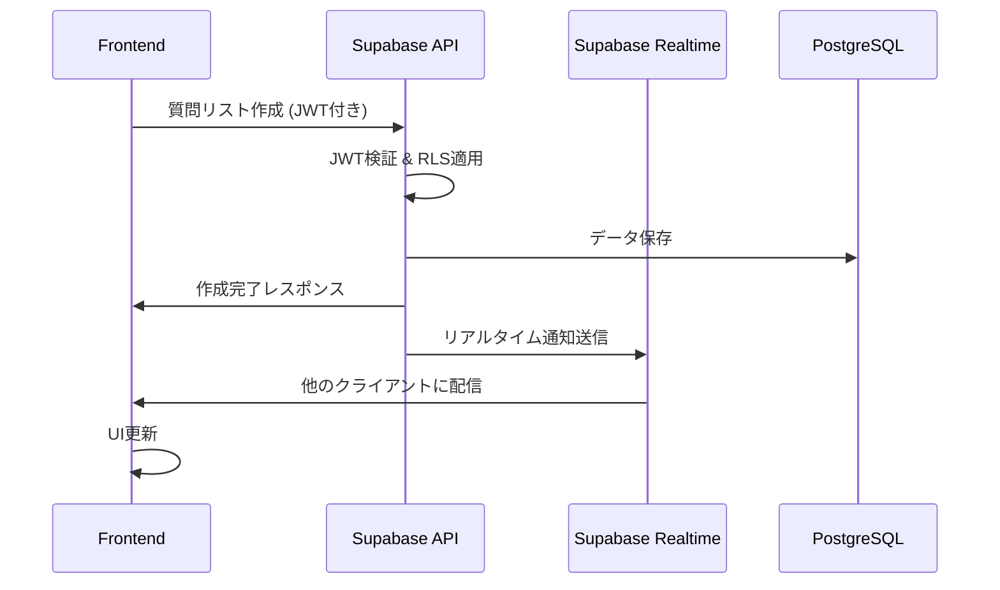

# 設計書

## 概要

保育園・幼稚園見学質問リスト管理アプリは、PWA（Progressive Web App）として実装し、ローカルファースト設計を採用します。スマートフォンでの使いやすさを最優先とし、オフライン機能とリアルタイム同期を提供する現代的な Web アプリケーションです。

## アーキテクチャ

### 全体アーキテクチャ

```
┌─────────────────────────────────────┐
│           PWA Frontend              │
│  ┌─────────────┐ ┌─────────────────┐│
│  │   React     │ │  Service Worker ││
│  │ Components  │ │  (Offline Cache)││
│  └─────────────┘ └─────────────────┘│
└─────────────────────────────────────┘
           │                 │
           ▼                 ▼
┌─────────────────┐ ┌─────────────────┐
│   IndexedDB     │ │  Supabase Auth  │
│ (Offline Cache) │ │   & Realtime    │
└─────────────────┘ └─────────────────┘
           │                 │
           ▼                 ▼
┌─────────────────┐ ┌─────────────────┐
│   AWS Amplify   │ │    Supabase     │
│   (Hosting)     │ │  (PostgreSQL)   │
└─────────────────┘ └─────────────────┘
```

### 技術スタック

- **フロントエンド**: React 19 + TypeScript + Vite
- **UI フレームワーク**: Chakra UI v3 + Emotion
- **状態管理**: Zustand（軽量でシンプル）
- **バックエンド API**: Supabase（PostgreSQL、REST API）
- **データベース**: Supabase（PostgreSQL、クラウド型）
- **認証**: Supabase Auth（OAuth対応）
- **リアルタイム通信**: Supabase Realtime（WebSocket）
- **オフラインキャッシュ**: IndexedDB（Dexie.js ラッパー使用）
- **PWA**: Workbox（Service Worker 管理）
- **テスト**: Vitest + React Testing Library
- **ホスティング**: AWS Amplify Hosting

#### 統合プラットフォーム構成の選択理由

**Supabase（フルスタックバックエンド）**:

- **OAuth認証**: Google/LINE簡単設定
- **PostgreSQLデータベース**: 高機能・高信頼性
- **リアルタイム機能**: WebSocket ベースの自動同期
- **REST API**: 自動生成される高性能API
- **実績**: 安定したフルスタックソリューション

**AWS Amplify（ホスティング）**:

- **簡単デプロイ**: GitHubとの自動連携
- **グローバルCDN**: 世界中で高速配信
- **自動スケーリング**: トラフィック増加に自動対応
- **コスト効率**: 使用量ベース課金
- **AWS統合**: 将来的な機能拡張に対応

## コンポーネント設計

### 主要コンポーネント

#### 1. アプリケーション層

- **App**: ルートコンポーネント、PWA 初期化
- **Router**: ページルーティング管理
- **Layout**: 共通レイアウト、ナビゲーション

#### 2. ページコンポーネント

- **HomePage**: 保育園カード一覧、新規保育園追加ボタン
- **NurseryDetailPage**: 保育園詳細、見学日設定、質問リスト管理、回答入力
- **TemplatePage**: 質問テンプレート選択・管理
- **SettingsPage**: アプリ設定、データ管理
- **PrintPage**: 印刷用レイアウト

#### 3. 機能コンポーネント

- **NurseryCard**: 保育園カード表示
- **NurseryForm**: 保育園情報入力・編集フォーム
- **VisitSessionCard**: 見学セッションカード表示
- **VisitSessionForm**: 見学セッション作成・編集フォーム
- **QuestionItem**: 個別質問表示・編集
- **AnswerInput**: 回答入力フォーム
- **InsightsSection**: 気づきタグ管理（タグ追加・表示・削除機能付き）
- **InsightTagInput**: 気づきタグ入力フォーム
- **InsightTag**: 個別タグ表示・削除コンポーネント
- **TemplateSelector**: 質問テンプレート選択
- **SyncIndicator**: 同期状況表示
- **OfflineIndicator**: オフライン状態表示
- **ShareModal**: 共有設定モーダル

### データモデル

#### Nursery（保育園）

```typescript
interface Nursery {
  id: string;
  name: string;
  visitSessions: VisitSession[];
  createdAt: Date;
  updatedAt: Date;
}
```

#### VisitSession（見学セッション）

```typescript
interface VisitSession {
  id: string;
  visitDate: Date;
  status: 'planned' | 'completed' | 'cancelled';
  questions: Question[];
  insights?: string[]; // 気づきタグの配列（タグ形式で管理）
  sharedWith?: string[]; // 共有相手のID
  createdAt: Date;
  updatedAt: Date;
}
```

#### Question（質問）

```typescript
interface Question {
  id: string;
  text: string;
  answer?: string;
  isAnswered: boolean;
  answeredBy?: string; // 回答者ID
  answeredAt?: Date;
  createdAt: Date;
  updatedAt: Date;
}
```

#### QuestionTemplate（質問テンプレート）

```typescript
interface QuestionTemplate {
  id: string;
  title: string;
  description?: string;
  ageGroup?: string; // '0-1歳', '1-2歳', '2-3歳', '一般'
  questions: Omit<
    Question,
    'id' | 'answer' | 'isAnswered' | 'answeredBy' | 'answeredAt'
  >[];
  createdAt: Date;
  updatedAt: Date;
}
```

#### SyncState（同期状態）

```typescript
interface SyncState {
  isOnline: boolean;
  lastSyncAt?: Date;
  pendingChanges: number;
  conflictResolution?: 'local' | 'remote' | 'manual';
}
```

## インターフェース設計

### API 設計（内部）

#### データストア（IndexedDB）

```typescript
class DataStore {
  // 質問リスト管理
  async createQuestionList(list: QuestionList): Promise<string>;
  async getQuestionList(id: string): Promise<QuestionList | null>;
  async updateQuestionList(
    id: string,
    updates: Partial<QuestionList>
  ): Promise<void>;
  async deleteQuestionList(id: string): Promise<void>;
  async getAllQuestionLists(): Promise<QuestionList[]>;

  // 質問管理
  async updateQuestion(
    listId: string,
    questionId: string,
    updates: Partial<Question>
  ): Promise<void>;
  async addQuestion(
    listId: string,
    question: Omit<Question, 'id'>
  ): Promise<string>;
  async deleteQuestion(listId: string, questionId: string): Promise<void>;

  // テンプレート管理
  async getTemplates(): Promise<QuestionList[]>;
  async createFromTemplate(
    templateId: string,
    customizations: Partial<QuestionList>
  ): Promise<string>;
}
```

#### Supabase サービス（認証・リアルタイム）

```typescript
class SupabaseAuthService {
  // OAuth認証管理
  async signInWithGoogle(): Promise<User>;
  async signInWithLine(): Promise<User>;
  async signOut(): Promise<void>;
  async getCurrentUser(): Promise<User | null>;
  async getSession(): Promise<Session | null>;
}

class SupabaseRealtimeService {
  // リアルタイム同期
  subscribeToQuestionList(
    listId: string,
    callback: (payload: any) => void
  ): RealtimeSubscription;

  broadcastQuestionUpdate(listId: string, questionData: any): Promise<void>;

  subscribeToUserPresence(
    listId: string,
    callback: (users: any[]) => void
  ): RealtimeSubscription;
}
```

#### Supabase API サービス

```typescript
class SupabaseAPIService {
  // 質問リスト管理（PostgreSQLデータベース）
  async createQuestionList(
    list: Omit<QuestionList, 'id' | 'createdAt' | 'updatedAt'>
  ): Promise<QuestionList>;

  async getQuestionLists(): Promise<QuestionList[]>;

  async updateQuestionList(
    id: string,
    updates: Partial<QuestionList>
  ): Promise<QuestionList>;

  async deleteQuestionList(id: string): Promise<void>;

  // 共有機能
  async shareQuestionList(listId: string, email: string): Promise<void>;

  async getSharedLists(): Promise<QuestionList[]>;

  async removeShare(listId: string, userId: string): Promise<void>;

  // 同期状態管理
  getSyncState(): SyncState;
  onSyncStateChange(callback: (state: SyncState) => void): void;
}
```

#### データベーススキーマ（Supabase - PostgreSQL）

```sql
-- ユーザープロファイル（Supabase Authと連携）
CREATE TABLE profiles (
  id UUID REFERENCES auth.users(id) PRIMARY KEY,
  email TEXT UNIQUE,
  display_name TEXT,
  provider TEXT NOT NULL, -- 'google', 'line' など
  provider_id TEXT NOT NULL, -- プロバイダー固有のユーザーID
  avatar_url TEXT, -- プロフィール画像URL
  created_at TIMESTAMPTZ DEFAULT NOW(),
  updated_at TIMESTAMPTZ DEFAULT NOW(),
  UNIQUE(provider, provider_id)
);

-- 質問リスト
CREATE TABLE question_lists (
  id UUID DEFAULT gen_random_uuid() PRIMARY KEY,
  title TEXT NOT NULL,
  nursery_name TEXT,
  visit_date DATE,
  owner_id UUID REFERENCES profiles(id) NOT NULL,
  is_template BOOLEAN DEFAULT FALSE,
  created_at TIMESTAMPTZ DEFAULT NOW(),
  updated_at TIMESTAMPTZ DEFAULT NOW()
);

-- 質問
CREATE TABLE questions (
  id UUID DEFAULT gen_random_uuid() PRIMARY KEY,
  list_id UUID REFERENCES question_lists(id) ON DELETE CASCADE,
  text TEXT NOT NULL,
  answer TEXT,
  is_answered BOOLEAN DEFAULT FALSE,
  answered_by UUID REFERENCES profiles(id),
  answered_at TIMESTAMPTZ,
  created_at TIMESTAMPTZ DEFAULT NOW(),
  updated_at TIMESTAMPTZ DEFAULT NOW()
);

-- 共有設定
CREATE TABLE question_list_shares (
  id UUID DEFAULT gen_random_uuid() PRIMARY KEY,
  list_id UUID REFERENCES question_lists(id) ON DELETE CASCADE,
  shared_with UUID REFERENCES profiles(id) ON DELETE CASCADE,
  permission TEXT CHECK (permission IN ('read', 'write')) DEFAULT 'write',
  created_at TIMESTAMPTZ DEFAULT NOW(),
  UNIQUE(list_id, shared_with)
);

-- Row Level Security (RLS) ポリシー
ALTER TABLE profiles ENABLE ROW LEVEL SECURITY;
ALTER TABLE question_lists ENABLE ROW LEVEL SECURITY;
ALTER TABLE questions ENABLE ROW LEVEL SECURITY;
ALTER TABLE question_list_shares ENABLE ROW LEVEL SECURITY;

-- プロファイルは自分のもののみアクセス可能
CREATE POLICY "Users can view own profile" ON profiles FOR SELECT USING (auth.uid() = id);
CREATE POLICY "Users can update own profile" ON profiles FOR UPDATE USING (auth.uid() = id);

-- 質問リストは所有者または共有相手のみアクセス可能
CREATE POLICY "Users can view own question lists" ON question_lists FOR SELECT USING (
  auth.uid() = owner_id OR
  auth.uid() IN (SELECT shared_with FROM question_list_shares WHERE list_id = question_lists.id)
);

-- インデックス（パフォーマンス最適化）
CREATE INDEX idx_question_lists_owner ON question_lists(owner_id);
CREATE INDEX idx_questions_list ON questions(list_id);
CREATE INDEX idx_shares_list ON question_list_shares(list_id);
CREATE INDEX idx_shares_user ON question_list_shares(shared_with);
```

#### データ同期フロー



### UI/UX 設計原則

#### モバイルファースト設計

- **タッチターゲット**: 最小 44px×44px
- **フォントサイズ**: 最小 16px（ズーム防止）
- **入力フィールド**: 大きめのタップエリア
- **スクロール**: 慣性スクロール対応

#### レスポンシブデザイン

- **ブレークポイント**:
  - Mobile: 320px-768px
  - Tablet: 768px-1024px
  - Desktop: 1024px+

#### アクセシビリティ

- **ARIA 属性**: 適切なラベリング
- **キーボードナビゲーション**: Tab 順序の最適化
- **カラーコントラスト**: WCAG AA 準拠
- **スクリーンリーダー**: 対応

## エラーハンドリング

### エラー分類と対応

#### 1. ネットワークエラー

- **オフライン状態**: ローカルストレージで継続動作
- **同期失敗**: 再試行機能、手動同期オプション
- **接続タイムアウト**: ユーザーフレンドリーなエラーメッセージ

#### 2. データエラー

- **保存失敗**: 自動リトライ、データ復旧機能
- **競合発生**: 競合解決 UI、マージ機能
- **データ破損**: バックアップからの復元

#### 3. ユーザーエラー

- **入力検証**: リアルタイムバリデーション
- **操作ミス**: Undo/Redo 機能
- **誤削除**: 削除確認ダイアログ、ゴミ箱機能

### エラー監視

```typescript
class ErrorHandler {
  logError(error: Error, context: string): void;
  showUserFriendlyMessage(error: Error): void;
  reportCriticalError(error: Error): void;
  recoverFromError(error: Error): Promise<boolean>;
}
```

## テスト戦略（TDD 採用）

### TDD（テスト駆動開発）アプローチ

#### Red-Green-Refactor サイクル

1. **Red**: 失敗するテストを書く
2. **Green**: テストを通す最小限のコードを書く
3. **Refactor**: コードを改善する

#### テスト分類（t-wada 流）

#### 1. 単体テスト（Unit Test）- 70%

**目的**: 個別の関数・コンポーネントの動作確認

```typescript
// 例: 質問の回答状態更新
describe('Question', () => {
  test('回答を入力すると isAnswered が true になる', () => {
    // Red: 失敗するテストを先に書く
    const question = new Question('質問内容');
    question.setAnswer('回答内容');
    expect(question.isAnswered).toBe(true);
  });
});
```

**対象**:

- ビジネスロジック関数
- React コンポーネント（React Testing Library）
- カスタムフック
- ユーティリティ関数

#### 2. 統合テスト（Integration Test）- 20%

**目的**: コンポーネント間の連携確認

```typescript
// 例: 質問リスト作成フロー
describe("質問リスト作成", () => {
  test("テンプレートから質問リストを作成できる", async () => {
    // Red: 統合的な動作のテストを先に書く
    render(<QuestionListCreator />);

    // テンプレート選択
    await user.click(screen.getByText("0歳児テンプレート"));

    // カスタマイズ
    await user.type(screen.getByLabelText("園名"), "テスト保育園");

    // 保存
    await user.click(screen.getByText("保存"));

    // 結果確認
    expect(screen.getByText("質問リストが作成されました")).toBeInTheDocument();
  });
});
```

**対象**:

- ページコンポーネント間の連携
- データフロー（API → Store → Component）
- Supabase との連携

#### 3. E2E テスト（End-to-End Test）- 10%

**目的**: ユーザーシナリオ全体の動作確認

```typescript
// 例: 見学当日の使用シナリオ
test('見学当日: 質問リストを使って回答を記録できる', async ({ page }) => {
  // ログイン（ボタンのテキストで特定）
  await page.goto('/login');
  await page.getByRole('button', { name: 'Googleでログイン' }).click();

  // 質問リスト選択（見出しで特定）
  await page.getByRole('heading', { name: '保育園見学質問リスト' }).click();

  // 質問に回答（ラベルで特定）
  const answerInput = page.getByLabelText('回答を入力してください');
  await answerInput.fill('回答内容');
  await answerInput.press('Enter');

  // 回答済み質問が下に移動することを確認（テキストで特定）
  await expect(page.getByText('回答済み')).toBeVisible();
});
```

### TDD 実践のためのツール設定

#### テスト環境

- **テストランナー**: Vitest（高速、TypeScript 対応）
- **コンポーネントテスト**: React Testing Library
- **E2E テスト**: Playwright
- **モック**: MSW（Mock Service Worker）
- **カバレッジ**: c8（Vitest 内蔵）

#### テスト支援ツール

```typescript
// テストヘルパー
export const renderWithProviders = (ui: ReactElement) => {
  return render(ui, {
    wrapper: ({ children }) => (
      <QueryClient>
        <SupabaseProvider>{children}</SupabaseProvider>
      </QueryClient>
    ),
  });
};

// モックデータファクトリー
export const createMockQuestionList = (overrides = {}) => ({
  id: "mock-list-id",
  title: "テスト質問リスト",
  questions: [],
  createdAt: new Date(),
  ...overrides,
});

// セマンティックなテストヘルパー
export const testHelpers = {
  // ロール・ラベル・テキストベースの要素取得
  getQuestionInput: (container: HTMLElement) =>
    screen.getByLabelText(/質問を入力/i),
  getAnswerInput: (container: HTMLElement) =>
    screen.getByLabelText(/回答を入力/i),
  getSaveButton: (container: HTMLElement) =>
    screen.getByRole("button", { name: /保存/i }),
  getQuestionList: (container: HTMLElement) =>
    screen.getByRole("list", { name: /質問リスト/i }),
};
```

### TDD 開発フロー例

#### 機能開発の流れ

1. **要件理解**: 受入基準をテストケースに変換
2. **Red**: 失敗するテストを書く
3. **Green**: 最小限の実装でテストを通す
4. **Refactor**: コードを改善（テストは変更しない）
5. **繰り返し**: 次の機能に進む

#### 継続的改善

- **テストファースト**: 実装前にテストを書く習慣
- **小さなステップ**: 一度に一つの機能のみ実装
- **リファクタリング**: 動作を変えずにコードを改善
- **テストの保守**: テストコードも品質を保つ

## セキュリティ設計

### データ保護

#### 暗号化

```typescript
class CryptoService {
  async encryptData(data: string, key: CryptoKey): Promise<ArrayBuffer>;
  async decryptData(
    encryptedData: ArrayBuffer,
    key: CryptoKey
  ): Promise<string>;
  async generateKey(): Promise<CryptoKey>;
  async deriveKey(password: string, salt: Uint8Array): Promise<CryptoKey>;
}
```

#### データライフサイクル

- **作成時**: 自動暗号化
- **保存時**: IndexedDB 内で暗号化状態
- **読み込み時**: 自動復号化
- **削除時**: 完全削除（ガベージコレクション対応）

### プライバシー保護

- **ログ記録**: 個人情報除外
- **エラー報告**: 匿名化
- **分析データ**: 収集しない（プライバシーファースト）

## パフォーマンス最適化

### 読み込み最適化

- **コード分割**: React.lazy + Suspense
- **リソース最適化**: 画像圧縮、フォント最適化
- **キャッシュ戦略**: Service Worker 活用

### 実行時最適化

- **仮想化**: 大量質問リスト対応
- **デバウンス**: 入力処理最適化
- **メモ化**: React.memo, useMemo 活用

### ストレージ最適化

- **データ圧縮**: 保存前圧縮
- **インデックス**: 検索性能向上
- **クリーンアップ**: 不要データ自動削除

## シンプルUI設計（2025年7月改訂）

### UI簡素化の背景

既存の設計では「ホーム」「保育園管理」「新規作成」と複数のナビゲーションがあり、ユーザーが各機能の役割を理解しにくい状況でした。これを保育園中心のシンプルなフローに変更します。

### 新しい画面構成

```
┌─────────────────────────┐
│  保育園見学アプリ        │  ← アプリヘッダー
├─────────────────────────┤
│  [＋ 保育園を追加する]   │  ← メインアクション
├─────────────────────────┤
│ ┌─────────────────────┐ │
│ │ ○○保育園           │ │  ← 保育園カード
│ │ 見学日: 2/15(土)   │ │     （タップで詳細へ）
│ │ 質問進捗: 3/10     │ │
│ └─────────────────────┘ │
│ ┌─────────────────────┐ │
│ │ △△保育園           │ │
│ │ 見学日: 未定       │ │
│ │ 質問進捗: 0/10     │ │
│ └─────────────────────┘ │
└─────────────────────────┘
```

### 主要な変更点

1. **ホーム画面 = 保育園一覧**
   - 保育園カードをメインコンテンツとして表示
   - 一目で見学状況と質問進捗を把握可能

2. **ナビゲーション簡素化**
   - 「保育園管理」メニューを削除
   - 「新規作成」を「＋ 保育園を追加する」に変更
   - 画面遷移を最小限に抑制

3. **保育園詳細画面の統合**
   - 見学日設定
   - 質問リスト管理
   - 回答入力
   - 保育園情報編集
   - すべてを1つの画面に集約

### ユーザーフローの改善

```
1. アプリ起動 → 保育園一覧（ホーム）
2. 保育園カードタップ → 保育園詳細
3. 詳細画面で全ての操作が完結
   - 見学日の設定
   - 質問の追加・編集・削除
   - 回答の入力
   - 保育園情報の編集
```

### 技術的な変更

- `HomePage` コンポーネントを保育園一覧表示に変更
- ルーティングを `/` と `/nursery/:id` の2つに簡素化
- 不要なページコンポーネントを削除

## 分析・プライバシー機能設計

### 分析機能アーキテクチャ

```
┌─────────────────────────────────────┐
│           PWA Frontend              │
│  ┌─────────────┐ ┌─────────────────┐│
│  │   React     │ │ Analytics Layer ││
│  │ Components  │ │ ┌─────────────┐ ││
│  └─────────────┘ │ │ GA4 Service │ ││
│                  │ │ Clarity SDK │ ││
│                  │ │ Privacy Mgr │ ││
│                  │ └─────────────┘ ││
│                  └─────────────────┘│
└─────────────────────────────────────┘
           │                 │
           ▼                 ▼
┌─────────────────┐ ┌─────────────────┐
│ Google Analytics│ │ Microsoft       │
│ 4 (GA4)         │ │ Clarity         │
└─────────────────┘ └─────────────────┘
```

### 分析機能コンポーネント設計

#### 1. 分析サービス層

```typescript
// 分析イベント管理
interface AnalyticsEvent {
  name: string;
  parameters?: Record<string, any>;
  timestamp: Date;
}

interface AnalyticsService {
  // 初期化
  initialize(): Promise<void>;
  // 同意管理
  setConsent(consent: boolean): void;
  getConsent(): boolean;
  disable(): void;
  // イベント送信
  trackPageView(page: string): void;
  trackEvent(event: AnalyticsEvent): void;
  // 主要イベント
  trackNurseryCreated(nurseryId: string): void;
  trackQuestionAdded(nurseryId: string, questionCount: number): void;
  trackInsightAdded(nurseryId: string, insightCount: number): void;
  trackNurseryDeleted(nurseryId: string): void;
  trackInsightsViewed(nurseryId: string): void;
}

// Google Analytics 4 実装
class GA4Service implements AnalyticsService {
  private isEnabled = false;
  private consentGiven = false;
  private measurementId: string = (import.meta as any).env
    .VITE_GA4_MEASUREMENT_ID as string;
  private gtag: any;

  async initialize(): Promise<void> {
    if (!this.consentGiven) return;
    if ((import.meta as any).env.VITE_ANALYTICS_ENABLED === 'false') return;
    if (navigator.doNotTrack === '1') return;

    // GA4スクリプトの動的読み込み
    await this.loadGA4Script();
    this.isEnabled = true;
  }

  setConsent(consent: boolean): void {
    this.consentGiven = consent;
    if (!consent) this.disable();

    // Consent Mode v2: 同意状態を更新
    if (consent && (window as any).gtag) {
      (window as any).gtag('consent', 'update', {
        ad_storage: 'granted',
        analytics_storage: 'granted',
      });
    }
  }

  getConsent(): boolean {
    return this.consentGiven;
  }

  disable(): void {
    this.isEnabled = false;
    // Consent Mode v2: 全て denied に更新
    if ((window as any).gtag) {
      (window as any).gtag('consent', 'update', {
        ad_storage: 'denied',
        analytics_storage: 'denied',
      });
    }
  }

  private async loadGA4Script(): Promise<void> {
    const script = document.createElement('script');
    script.async = true;
    script.src = `https://www.googletagmanager.com/gtag/js?id=${this.measurementId}`;
    document.head.appendChild(script);

    // gtag関数の初期化
    (window as any).dataLayer = (window as any).dataLayer || [];
    (window as any).gtag = function () {
      (window as any).dataLayer.push(arguments);
    };
    (window as any).gtag('js', new Date());

    // Consent Mode v2: 初期は denied
    (window as any).gtag('consent', 'default', {
      ad_storage: 'denied',
      analytics_storage: 'denied',
    });

    (window as any).gtag('config', this.measurementId, {
      anonymize_ip: true,
      allow_google_signals: false,
      allow_ad_personalization_signals: false,
      // debug_mode は開発時のみ
      debug_mode: (import.meta as any).env.VITE_ANALYTICS_DEBUG === 'true',
    });
  }

  trackPageView(page: string): void {
    if (!this.isEnabled) return;

    (window as any).gtag('config', this.measurementId, {
      page_path: page,
    });
  }

  trackEvent(event: AnalyticsEvent): void {
    if (!this.isEnabled) return;

    (window as any).gtag('event', event.name, event.parameters);
  }

  trackNurseryCreated(nurseryId: string): void {
    this.trackEvent({
      name: 'nursery_created',
      parameters: { nursery_id: nurseryId },
      timestamp: new Date(),
    });
  }

  trackQuestionAdded(nurseryId: string, questionCount: number): void {
    this.trackEvent({
      name: 'question_added',
      parameters: { nursery_id: nurseryId, question_count: questionCount },
      timestamp: new Date(),
    });
  }

  trackInsightAdded(nurseryId: string, insightCount: number): void {
    this.trackEvent({
      name: 'insight_added',
      parameters: { nursery_id: nurseryId, insight_count: insightCount },
      timestamp: new Date(),
    });
  }

  trackNurseryDeleted(nurseryId: string): void {
    this.trackEvent({
      name: 'nursery_deleted',
      parameters: { nursery_id: nurseryId },
      timestamp: new Date(),
    });
  }

  trackInsightsViewed(nurseryId: string): void {
    this.trackEvent({
      name: 'insights_viewed',
      parameters: { nursery_id: nurseryId },
      timestamp: new Date(),
    });
  }
}

// Microsoft Clarity 実装
class ClarityService {
  private clarityId: string = (import.meta as any).env
    .VITE_CLARITY_PROJECT_ID as string;
  private isEnabled = false;
  private consentGiven = false;

  async initialize(): Promise<void> {
    if (!this.consentGiven) return;
    if ((import.meta as any).env.VITE_ANALYTICS_ENABLED === 'false') return;
    if (navigator.doNotTrack === '1') return;

    await this.loadClarityScript();
    this.setupDataMasking();
    this.isEnabled = true;
  }

  setConsent(consent: boolean): void {
    this.consentGiven = consent;
    if (!consent) this.disable();
  }

  getConsent(): boolean {
    return this.consentGiven;
  }

  disable(): void {
    this.isEnabled = false;
    if ((window as any).clarity) {
      (window as any).clarity('consent', false);
      (window as any).clarity('stop');
    }
  }

  private async loadClarityScript(): Promise<void> {
    const script = document.createElement('script');
    script.innerHTML = `
      (function(c,l,a,r,i,t,y){
        c[a]=c[a]||function(){(c[a].q=c[a].q||[]).push(arguments)};
        t=l.createElement(r);t.async=1;t.src="https://www.clarity.ms/tag/"+i;
        y=l.getElementsByTagName(r)[0];y.parentNode.insertBefore(t,y);
      })(window, document, "clarity", "script", "${this.clarityId}");
    `;
    document.head.appendChild(script);

    // 可能なら consent を false で初期化
    (window as any).clarity?.('consent', false);
  }

  private setupDataMasking(): void {
    // 個人情報を含む可能性のある要素をマスク
    const sensitiveSelectors = [
      'input[type="text"]',
      'input[type="email"]',
      'input[type="tel"]',
      'input[type="password"]',
      'input[type="date"]',
      'input[type="datetime-local"]',
      'textarea',
      '[data-sensitive]',
    ];

    sensitiveSelectors.forEach((selector) => {
      document.querySelectorAll(selector).forEach((element) => {
        element.setAttribute('data-clarity-mask', 'true');
      });
    });

    // 追加でテキスト全体のマスクを有効化
    (window as any).clarity?.('set', 'maskText', true);
  }
}
```

#### 2. プライバシー管理コンポーネント

```typescript
// プライバシー設定管理
interface PrivacySettings {
  analyticsConsent: boolean;
  clarityConsent: boolean;
  consentTimestamp: Date;
  consentVersion: string;
}

class PrivacyManager {
  private settings: PrivacySettings;
  private storageKey = 'privacy-settings';

  constructor() {
    this.loadSettings();
  }

  // 設定の読み込み
  private loadSettings(): void {
    const stored = localStorage.getItem(this.storageKey);
    if (stored) {
      this.settings = JSON.parse(stored);
      // Date を復元
      if (this.settings?.consentTimestamp) {
        this.settings.consentTimestamp = new Date(this.settings.consentTimestamp as any);
      }
    } else {
      this.settings = {
        analyticsConsent: false,
        clarityConsent: false,
        consentTimestamp: new Date(),
        consentVersion: '1.0'
      };
    }
  }

  // 設定の保存
  private saveSettings(): void {
    localStorage.setItem(this.storageKey, JSON.stringify(this.settings));
  }

  // 設定の取得（読み取り専用）
  getSettings(): Readonly<PrivacySettings> {
    return this.settings;
  }

  getConsentTimestamp(): Date {
    return this.settings.consentTimestamp;
  }

  // 同意状態の取得
  getAnalyticsConsent(): boolean {
    return this.settings.analyticsConsent;
  }

  getClarityConsent(): boolean {
    return this.settings.clarityConsent;
  }

  // 同意状態の更新
  setAnalyticsConsent(consent: boolean): void {
    this.settings.analyticsConsent = consent;
    this.settings.consentTimestamp = new Date();
    this.saveSettings();
  }

  setClarityConsent(consent: boolean): void {
    this.settings.clarityConsent = consent;
    this.settings.consentTimestamp = new Date();
    this.saveSettings();
  }

  // 全体同意の設定
  setAllConsent(consent: boolean): void {
    this.settings.analyticsConsent = consent;
    this.settings.clarityConsent = consent;
    this.settings.consentTimestamp = new Date();
    this.saveSettings();
  }

  // 同意が必要かどうかの判定
  needsConsent(): boolean {
    return !this.settings.consentTimestamp ||
           this.isConsentExpired();
  }

  private isConsentExpired(): boolean {
    const expiryDays = 365; // 1年間有効
    const expiryDate = new Date(this.settings.consentTimestamp);
    expiryDate.setDate(expiryDate.getDate() + expiryDays);
    return new Date() > expiryDate;
  }
}

// React コンポーネント
const CookieConsentBanner: React.FC = () => {
  const [isVisible, setIsVisible] = useState(false);
  const privacyManager = usePrivacyManager();

  useEffect(() => {
    setIsVisible(privacyManager.needsConsent());
  }, []);

  const handleAccept = () => {
    privacyManager.setAllConsent(true);
    setIsVisible(false);
    // 分析サービスを初期化・同意反映
    analyticsService.setConsent(true);
    clarityService.setConsent(true);
    analyticsService.initialize();
    clarityService.initialize();
  };

  const handleDecline = () => {
    privacyManager.setAllConsent(false);
    setIsVisible(false);
  };

  if (!isVisible) return null;

  return (
    <Box
      position="fixed"
      bottom={0}
      left={0}
      right={0}
      bg="white"
      p={4}
      boxShadow="lg"
      zIndex={1000}
    >
      <Text mb={3}>
        このアプリでは、サービス改善のためにGoogleアナリティクスとMicrosoft Clarityを使用しています。
        個人を特定する情報は収集しません。
      </Text>
      <HStack spacing={3}>
        <Button colorScheme="blue" onClick={handleAccept}>
          同意する
        </Button>
        <Button variant="outline" onClick={handleDecline}>
          拒否する
        </Button>
        <Button as={Link} to="/privacy-policy" variant="ghost" size="sm">
          詳細
        </Button>
      </HStack>
    </Box>
  );
};

const PrivacySettingsPage: React.FC = () => {
  const privacyManager = usePrivacyManager();
  const [analyticsConsent, setAnalyticsConsent] = useState(
    privacyManager.getAnalyticsConsent()
  );
  const [clarityConsent, setClarityConsent] = useState(
    privacyManager.getClarityConsent()
  );

  const handleAnalyticsChange = (consent: boolean) => {
    setAnalyticsConsent(consent);
    privacyManager.setAnalyticsConsent(consent);

    if (consent) {
      analyticsService.initialize();
    } else {
      analyticsService.disable();
    }
  };

  const handleClarityChange = (consent: boolean) => {
    setClarityConsent(consent);
    privacyManager.setClarityConsent(consent);

    if (consent) {
      clarityService.initialize();
    } else {
      clarityService.disable();
    }
  };

  return (
    <VStack spacing={6} align="stretch">
      <Heading size="md">プライバシー設定</Heading>

      <Box>
        <FormControl display="flex" alignItems="center">
          <FormLabel htmlFor="analytics-consent" mb="0">
            Googleアナリティクス
          </FormLabel>
          <Switch
            id="analytics-consent"
            isChecked={analyticsConsent}
            onChange={(e) => handleAnalyticsChange(e.target.checked)}
          />
        </FormControl>
        <Text fontSize="sm" color="gray.600" mt={1}>
          ページビューと機能使用状況を分析します
        </Text>
      </Box>

      <Box>
        <FormControl display="flex" alignItems="center">
          <FormLabel htmlFor="clarity-consent" mb="0">
            Microsoft Clarity
          </FormLabel>
          <Switch
            id="clarity-consent"
            isChecked={clarityConsent}
            onChange={(e) => handleClarityChange(e.target.checked)}
          />
        </FormControl>
        <Text fontSize="sm" color="gray.600" mt={1}>
          ユーザー操作の録画とヒートマップを収集します
        </Text>
      </Box>

      <Divider />

      <Box>
        <Text fontSize="sm" color="gray.600">
          最終更新: {privacyManager.getConsentTimestamp().toLocaleDateString()}
        </Text>
        <Text fontSize="sm" color="gray.600">
          設定はいつでも変更できます
        </Text>
      </Box>

      <Box mt={4}>
        <Link to="/privacy-policy" color="blue.500">
          プライバシーポリシーを確認する
        </Link>
      </Box>
    </VStack>
  );
};

// プライバシーポリシーページ
const PrivacyPolicyPage: React.FC = () => {
  return (
    <Container maxW="4xl" py={8}>
      <VStack spacing={8} align="stretch">
        <Heading size="lg">プライバシーポリシー</Heading>

        <Text fontSize="sm" color="gray.600">
          最終更新日: 2025年8月15日
        </Text>

        <Box>
          <Heading size="md" mb={4}>1. はじめに</Heading>
          <Text mb={4}>
            保育園見学質問リストアプリ（以下「本アプリ」）は、ユーザーのプライバシーを尊重し、
            個人情報の保護に努めています。本プライバシーポリシーでは、本アプリがどのような情報を
            収集し、どのように使用するかについて説明します。
          </Text>
        </Box>

        <Box>
          <Heading size="md" mb={4}>2. 収集する情報</Heading>
          <VStack align="stretch" spacing={3}>
            <Box>
              <Text fontWeight="bold" mb={2}>2.1 自動的に収集される情報</Text>
              <UnorderedList spacing={1} ml={4}>
                <ListItem>ページビュー情報（アクセスしたページ、滞在時間）</ListItem>
                <ListItem>デバイス情報（ブラウザの種類、OS、画面サイズ）</ListItem>
                <ListItem>使用機能の統計情報（保育園作成、質問追加など）</ListItem>
                <ListItem>ユーザー操作パターン（クリック位置、スクロール動作）</ListItem>
              </UnorderedList>
            </Box>

            <Box>
              <Text fontWeight="bold" mb={2}>2.2 収集しない情報</Text>
              <UnorderedList spacing={1} ml={4}>
                <ListItem>保育園名、質問内容、回答内容などの個人的な記録</ListItem>
                <ListItem>氏名、住所、電話番号などの個人識別情報</ListItem>
                <ListItem>IPアドレス（匿名化処理を実施）</ListItem>
                <ListItem>メールアドレスやその他の連絡先情報</ListItem>
              </UnorderedList>
            </Box>
          </VStack>
        </Box>

        <Box>
          <Heading size="md" mb={4}>3. 情報の使用目的</Heading>
          <UnorderedList spacing={2} ml={4}>
            <ListItem>アプリの機能改善とユーザーエクスペリエンスの向上</ListItem>
            <ListItem>技術的な問題の特定と解決</ListItem>
            <ListItem>新機能の開発における優先順位の決定</ListItem>
            <ListItem>アプリの使用状況の統計分析</ListItem>
          </UnorderedList>
        </Box>

        <Box>
          <Heading size="md" mb={4}>4. 使用する分析ツール</Heading>
          <VStack align="stretch" spacing={4}>
            <Box>
              <Text fontWeight="bold" mb={2}>4.1 Google Analytics 4</Text>
              <Text mb={2}>
                ページビューや機能使用状況の分析に使用します。以下の設定でプライバシーを保護しています：
              </Text>
              <UnorderedList spacing={1} ml={4}>
                <ListItem>IPアドレスの匿名化</ListItem>
                <ListItem>広告機能の無効化</ListItem>
                <ListItem>Googleシグナルの無効化</ListItem>
                <ListItem>データ保持期間の短縮（2ヶ月）</ListItem>
              </UnorderedList>
            </Box>

            <Box>
              <Text fontWeight="bold" mb={2}>4.2 Microsoft Clarity</Text>
              <Text mb={2}>
                ユーザー操作の録画とヒートマップ分析に使用します。以下の保護措置を実施しています：
              </Text>
              <UnorderedList spacing={1} ml={4}>
                <ListItem>入力フィールドの内容を自動的にマスク</ListItem>
                <ListItem>個人情報を含む可能性のある要素の非表示化</ListItem>
                <ListItem>Do Not Track設定の尊重</ListItem>
              </UnorderedList>
            </Box>
          </VStack>
        </Box>

        <Box>
          <Heading size="md" mb={4}>5. ユーザーの選択と制御</Heading>
          <VStack align="stretch" spacing={3}>
            <Text>
              ユーザーは以下の方法で分析機能を制御できます：
            </Text>
            <UnorderedList spacing={2} ml={4}>
              <ListItem>初回アクセス時の同意バナーで分析機能の使用を選択</ListItem>
              <ListItem>プライバシー設定ページでいつでも設定を変更</ListItem>
              <ListItem>個別に Google Analytics と Microsoft Clarity を制御</ListItem>
              <ListItem>ブラウザの Do Not Track 設定の利用</ListItem>
            </UnorderedList>
          </VStack>
        </Box>

        <Box>
          <Heading size="md" mb={4}>6. データの保存と削除</Heading>
          <VStack align="stretch" spacing={3}>
            <Text>
              収集されたデータは以下のように管理されます：
            </Text>
            <UnorderedList spacing={2} ml={4}>
              <ListItem>Google Analytics: 2ヶ月後に自動削除</ListItem>
              <ListItem>Microsoft Clarity: 1年後に自動削除</ListItem>
              <ListItem>ローカルストレージ: ユーザーがブラウザから削除可能</ListItem>
              <ListItem>同意設定: ユーザーが変更するまで保持</ListItem>
            </UnorderedList>
          </VStack>
        </Box>

        <Box>
          <Heading size="md" mb={4}>7. 第三者への情報提供</Heading>
          <Text>
            本アプリは、法的要請がある場合を除き、収集した情報を第三者に提供、販売、
            または共有することはありません。分析ツールの提供者（Google、Microsoft）は、
            それぞれのプライバシーポリシーに従って情報を処理します。
          </Text>
        </Box>

        <Box>
          <Heading size="md" mb={4}>8. セキュリティ</Heading>
          <Text>
            本アプリは、収集した情報を保護するために適切な技術的・組織的措置を講じています。
            ただし、インターネット上での情報伝送は完全に安全ではないことをご理解ください。
          </Text>
        </Box>

        <Box>
          <Heading size="md" mb={4}>9. 子どものプライバシー</Heading>
          <Text>
            本アプリは13歳未満の子どもから意図的に個人情報を収集することはありません。
            13歳未満の子どもの情報を収集していることが判明した場合、
            速やかに削除いたします。
          </Text>
        </Box>

        <Box>
          <Heading size="md" mb={4}>10. プライバシーポリシーの変更</Heading>
          <Text>
            本プライバシーポリシーは必要に応じて更新される場合があります。
            重要な変更がある場合は、アプリ内で通知いたします。
            継続してアプリを使用することで、更新されたポリシーに同意したものとみなされます。
          </Text>
        </Box>

        <Box>
          <Heading size="md" mb={4}>11. お問い合わせ</Heading>
          <Text>
            本プライバシーポリシーに関するご質問やご意見がございましたら、
            アプリ内の設定ページからお問い合わせください。
          </Text>
        </Box>

        <Divider />

        <HStack justify="center" spacing={4}>
          <Button as={Link} to="/privacy-settings" colorScheme="blue">
            プライバシー設定
          </Button>
          <Button as={Link} to="/" variant="outline">
            ホームに戻る
          </Button>
        </HStack>
      </VStack>
    </Container>
  );
};
```

#### 3. 分析イベント統合

```typescript
// React Hook for Analytics
const useAnalytics = () => {
  const analyticsService = useContext(AnalyticsContext);

  const trackPageView = useCallback((page: string) => {
    analyticsService.trackPageView(page);
  }, [analyticsService]);

  const trackNurseryCreated = useCallback((nurseryId: string) => {
    analyticsService.trackNurseryCreated(nurseryId);
  }, [analyticsService]);

  const trackQuestionAdded = useCallback((nurseryId: string, questionCount: number) => {
    analyticsService.trackQuestionAdded(nurseryId, questionCount);
  }, [analyticsService]);

  const trackInsightAdded = useCallback((nurseryId: string, insightCount: number) => {
    analyticsService.trackInsightAdded(nurseryId, insightCount);
  }, [analyticsService]);

  return {
    trackPageView,
    trackNurseryCreated,
    trackQuestionAdded,
    trackInsightAdded
  };
};

// Router レベルでのページビュー追跡
const AnalyticsRouter: React.FC<{ children: React.ReactNode }> = ({ children }) => {
  const location = useLocation();
  const { trackPageView } = useAnalytics();

  useEffect(() => {
    trackPageView(location.pathname);
  }, [location.pathname, trackPageView]);

  return <>{children}</>;
};

// コンポーネントでの使用例
const NurseryCreator: React.FC = () => {
  const { trackNurseryCreated } = useAnalytics();

  const handleCreateNursery = async (nurseryData: NurseryData) => {
    try {
      const nursery = await nurseryService.create(nurseryData);

      // 分析イベントを送信
      trackNurseryCreated(nursery.id);

      // 成功処理
      navigate(`/nursery/${nursery.id}`);
    } catch (error) {
      // エラー処理
    }
  };

  return (
    // コンポーネントのJSX
  );
};
```

### 環境設定とセキュリティ

#### 環境変数設定

```typescript
// .env.local
VITE_GA4_MEASUREMENT_ID = G - XXXXXXXXXX;
VITE_CLARITY_PROJECT_ID = xxxxxxxxxx;
VITE_ANALYTICS_ENABLED = true;

// .env.development
VITE_ANALYTICS_DEBUG = true;
VITE_ANALYTICS_ENABLED = false;

// .env.production
VITE_ANALYTICS_DEBUG = false;
VITE_ANALYTICS_ENABLED = true;
```

#### セキュリティ設定

```typescript
// Content Security Policy (CSP) 設定
const cspDirectives = {
  'script-src': [
    "'self'",
    "'unsafe-inline'", // GA4とClarityで必要
    'https://www.googletagmanager.com',
    'https://www.google-analytics.com',
    'https://www.clarity.ms',
  ],
  'connect-src': [
    "'self'",
    'https://www.google-analytics.com',
    'https://analytics.google.com',
    'https://www.clarity.ms',
  ],
  'img-src': [
    "'self'",
    'data:',
    'https://www.google-analytics.com',
    'https://www.googletagmanager.com',
  ],
};

// プライバシー保護設定
const privacyConfig = {
  // GA4設定
  ga4: {
    anonymize_ip: true,
    allow_google_signals: false,
    allow_ad_personalization_signals: false,
    cookie_expires: 60 * 60 * 24 * 30, // 30日
    storage: 'none', // Cookieを使用しない
  },

  // Clarity設定
  clarity: {
    maskTextContent: true,
    maskSensitiveElements: true,
    respectDoNotTrack: true,
  },
};
```

### デバッグ・監視機能

```typescript
// 開発環境でのデバッグ機能
class AnalyticsDebugger {
  private events: AnalyticsEvent[] = [];

  logEvent(event: AnalyticsEvent): void {
    if (import.meta.env.VITE_ANALYTICS_DEBUG === 'true') {
      console.group(`📊 Analytics Event: ${event.name}`);
      console.log('Parameters:', event.parameters);
      console.log('Timestamp:', event.timestamp);
      console.groupEnd();

      this.events.push(event);
    }
  }

  getEventHistory(): AnalyticsEvent[] {
    return this.events;
  }

  clearHistory(): void {
    this.events = [];
  }
}

// エラー監視
class AnalyticsErrorHandler {
  handleScriptLoadError(service: 'ga4' | 'clarity', error: Error): void {
    console.warn(`Failed to load ${service} script:`, error);

    // アプリの動作に影響を与えないようにする
    // 分析機能のみ無効化
    if (service === 'ga4') {
      analyticsService.disable();
    } else if (service === 'clarity') {
      clarityService.disable();
    }
  }

  handleEventSendError(event: AnalyticsEvent, error: Error): void {
    console.warn('Failed to send analytics event:', event.name, error);

    // 必要に応じてローカルストレージに保存して後で再送信
    this.queueFailedEvent(event);
  }

  private queueFailedEvent(event: AnalyticsEvent): void {
    const failedEvents = JSON.parse(
      localStorage.getItem('failed-analytics-events') || '[]'
    );
    failedEvents.push(event);
    localStorage.setItem(
      'failed-analytics-events',
      JSON.stringify(failedEvents)
    );
  }
}
```

### パフォーマンス最適化

```typescript
// 遅延読み込み
class LazyAnalyticsLoader {
  private loaded = false;
  private pendingEvents: AnalyticsEvent[] = [];

  async loadWhenReady(): Promise<void> {
    // ユーザーの操作が落ち着いてから読み込み
    await this.waitForUserIdle();

    if (privacyManager.getAnalyticsConsent()) {
      await this.loadAnalyticsScripts();
      this.processPendingEvents();
      this.loaded = true;
    }
  }

  private async waitForUserIdle(): Promise<void> {
    return new Promise((resolve) => {
      if ('requestIdleCallback' in window) {
        requestIdleCallback(() => resolve());
      } else {
        setTimeout(() => resolve(), 2000);
      }
    });
  }

  trackEvent(event: AnalyticsEvent): void {
    if (this.loaded) {
      analyticsService.trackEvent(event);
    } else {
      this.pendingEvents.push(event);
    }
  }

  private processPendingEvents(): void {
    this.pendingEvents.forEach((event) => {
      analyticsService.trackEvent(event);
    });
    this.pendingEvents = [];
  }
}
```

この設計により、プライバシーを尊重しながら効果的な分析機能を提供し、ユーザーが安心してアプリを使用できる環境を構築します。
